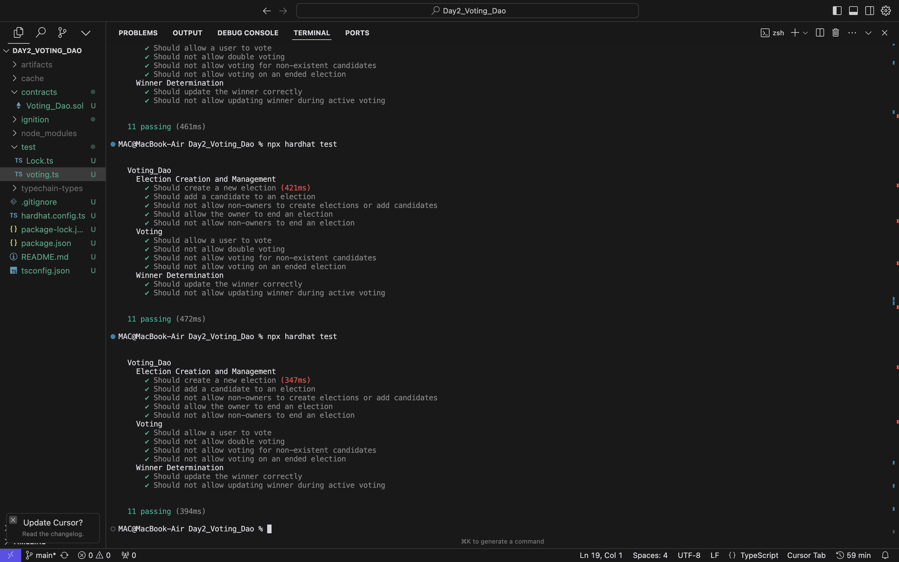
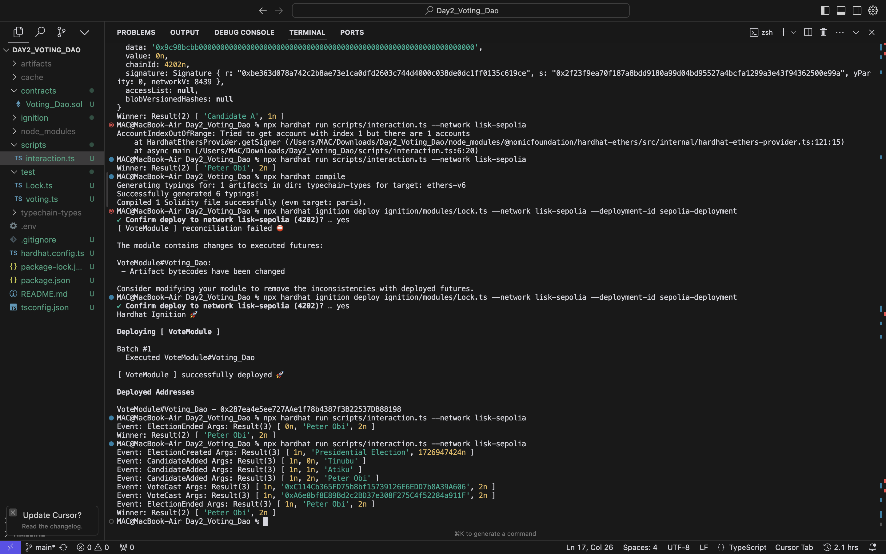

# Voting Smart Contract Project

This project demonstrates a basic voting system implemented as a smart contract using Solidity. It includes the contract, tests, and instructions for interaction.

## Project Structure

- `contracts/Voting.sol`: The main voting contract
- `test/Voting.test.js`: Tests for the Voting contract
- `scripts/interact.js`: Script to interact with the deployed contract

## Getting Started

1. Install dependencies:
   ```shell
   npm install
   ```

2. Compile the contract:
   ```shell
   npx hardhat compile
   ```

3. Run tests:
   ```shell
   npx hardhat test
   ```

4. Deploy the contract:
   ```shell
   npx hardhat run scripts/deploy.js --network <your-network>
   ```

5. Interact with the contract:
   ```shell
   npx hardhat run scripts/interact.js --network <your-network>
   ```

## Contract Overview

The `Voting.sol` contract allows:
- Adding candidates
- Casting votes
- Retrieving voting results

## Testing

The `Voting.test.js` file contains unit tests for the contract, covering:
- Candidate addition
- Voting mechanism
- Result retrieval

### Test Results



## Interaction

The `interact.js` script demonstrates how to:
- Connect to the deployed contract
- Add candidates
- Cast votes
- Retrieve voting results

### Interaction Script Example

